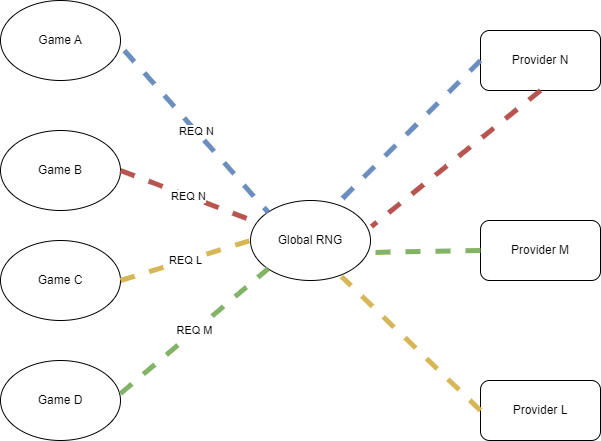

# Ridotto Global RNG

- [Ridotto Global RNG](#ridotto-global-rng)
  - [Supported providers:](#supported-providers)
  - [Smart Contract Addresses:](#smart-contract-addresses)
    - [Goerli Testnet](#goerli-testnet)
  - [Guide](#guide)
  - [Built With](#built-with)
  - [How to run it locally?](#how-to-run-it-locally)
  - [Contributing](#contributing)
  - [License](#license)
  - [Contact](#contact)

This repository contains the base code for Ridotto's Global RNG smart contract.

The global RNG act as a router to forward a request to a specified provider.



## Supported providers:

- Chainlink: [More info here](https://docs.chain.link/vrf/v2/introduction)
- Custom Provider

## Smart Contract Addresses:

### Goerli Testnet

**Mocked Version**

| Component                   | Address                                    |
| --------------------------- | ------------------------------------------ |
| Global RNG - Proxy Admin    | 0x63537080e95d1DAC53c07Af1a76AB2bFd4F55eB7 |
| Global RNG - Proxy          | 0x9b7EFfFe6F14539c29617396bF795C14bd19228b |
| Global RNG - Implementation | 0x027a2C240109Bc1D728787cB74c2aE459375F055 |
| MockedVRF2                  | 0x4a244eFC02cfc47c58AAE5463228a32DeefD2A02 |

⚠️⚠️**Note:**⚠️⚠️

- These addresses are for the mocked version of the smart contracts, which are used for testing purposes.
- After deployment, you need to grant the game smart contract with the `CONSUMER_ROLE`
- To inject a random number, call the `fulfillRandomWordsWithOverride` function of MockedVRF2 and pass in the `_requestId`, the `globalRNG` address as `_consumer`, and an array with a single number as `_words` (e.g. [1234567]).

**None-Mocked Version** (to be deployed)

## Guide

- Uses Request-Return based RNG provider mechanism
- Achieved with 2 functions requestRandomWords(),fallback() which supports multiple providers
- Uses low-level call to route the function data given as a parameter in the requestRandomwords() function to request any supported Provider
- The result of the above low-level call is deconstructed by the 0,1st parameters of the uint256[6] array in the provider struct
- The return function from the RNG mechanism is routed to either fallback() or the rawFulfillRandomWords() functions
- The 2,3rd parameters from the array are used to deconstruct the requestId from the returnCall
- The 4,5th parameters from the array are used to deconstruct the rngResult from the msg.data fed into fallback()

## Built With

- [Hardhat](https://hardhat.org/)
- [Solidity](https://soliditylang.org/)

## How to run it locally?

- Compile:

```
npm install
npx hardhat compile
```

- Run tests:

```
npx hardhat test
```

## How to use the package locally
If you have access to the package, create a token from github that has only read package access.
Inject the token into the **.npmrc** file by replacing **GITHUB_TOKEN** with your token:
```
@ridotto-io:registry=https://npm.pkg.github.com/
//npm.pkg.github.com/:_authToken=GITHUB_TOKEN
```

then install the package manually:
```
npm install @ridotto-io/global-rng@1.0.0
```

or install through package.json:
```
"@ridotto-io/global-rng": "1.0.0"
```

## Package Version Control

The package.json file uses the version field to specify the version number of the package, following the format MAJOR.MINOR.PATCH. The version number should be updated accordingly for each new release.

## Deployment of the package

The package is deployed through a simple workflow that publishes the package to github(npm packages) as a private npm package.

## Contributing

Contributions are what makes the open-source community such an amazing place to learn, inspire, and create. Any contributions you make are

**greatly appreciated**.

If you have a suggestion that would make this better, please fork the repo and create a pull request. You can also simply open an issue with the tag "enhancement".
Don't forget to give the project a star! Thanks again!

1. Fork the Project
2. Create your Feature Branch (`git checkout -b JIRA-KEY`)
3. Commit your Changes (`git commit -m 'Add some AmazingFeature'`)
4. Push to the Branch (`git push origin feature/JIRA-KEY`)
5. Open a Pull Request
6. Fill the Pull Request template

## License

The primary license for Ridotto NFT Farming is **Ridotto Core License** see [`LICENSE`](./LICENSE).

## Contact

Ridotto - [@ridotto_io](https://twitter.com/ridotto_io) - requests@ridotto.io
